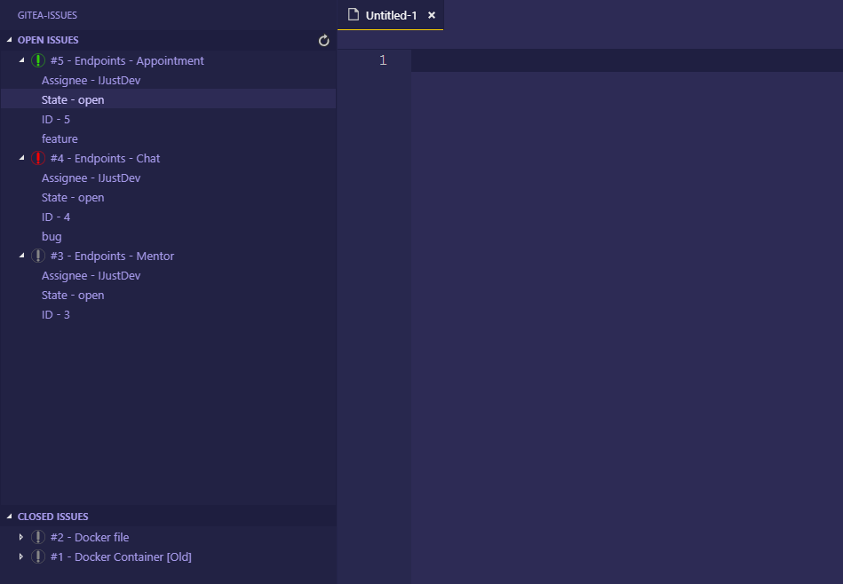

# Gitea-VSCode

Issuetracker for Gitea

## Getting Started

To setup a gitea issue tracked project you need to first select the issues tab at the activitiy bar. After that open the command palette in order to enter your crendentials:
- Authtoken
- Domain in format: "example.com"
- Repository Owner (may be an organisation): "TestOrganisation"
- Repository Name "ExampleRepository"

When you've finished you can press the refresh button in the open issues section and you'll see the issues of the first 10 pages (only open issues).

## Issue colors

In order to get nice looking issue icons in multiple colors (of your choice) you just need to assign a label to your issue. The color is being fetched automatically. If you change the color of the label however, you need to delete the `.gitea/{issuename}.svg` file in the given folder. If you skip this step, the file is not going to get updated. In most cases you need to restart visual studio code to apply the icons in the issues tab.
## Future
- Implement a `Close Issue` Button
- Create Issues via Webview
- `Comment` Issues